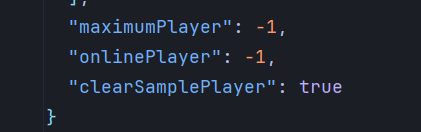

<div align="center">


<h3>Made By <a href="https://github.com/RTAkland">RTAkland</a></h3>


<br>


</div>

* English docs [README](./README_en.md)

# 概述

> 可以让你的服务器信息个性化,包括:`ip指纹`、 `随机MOTD描述信息`、 `虚假的在线玩家数`、`虚假的最大玩家数`、`随机服务器icon`、*防压测*

# 使用

> 本项目是一个[`Velocity`](https://velocitypowered.com/)插件,
> 可以在[`Releases`](https://github.com/RTAkland/YeeeesMOTD/releases/)中下载插件, 将插件放入plugins文件夹内即可使用

# 使用

## ip指纹

> 此功能需要服务器`开启正版验证`并且服务器`有公网IP`  
> ip指纹可以记录玩家登陆游戏的ip在下次玩家使用这个ip ping服务器的时候就会有如下效果(
> 将玩家皮肤的头作为服务器的icon显示给玩家):


## 随机服务器icon

> 随机服务器的icon需要提前准备几张`64x64`像素大小的图片放入服务器`plugins/YeeeesMotd/icons`
> 文件夹内且图片格式必须为`png`

> 使用`yesmotd reload`可以热重载服务器随机icon列表

## MOTD信息

> 你需要先启动一次反向代理初始化所需的文件, 在`plugins/YeeeesMotd/`文件夹内你可以找到
> `descriptions.json`文件, 用任意一个文本编辑器(比如: Windows自带的记事本, vi, vim等)
> 需要实现以下效果：


> 你需要打开`config.json`, 找到`descriptions`根下， 你可以看到以下内容，可以修改对应行的内容
> 其中`line1`表示第一行, `line2`表示第二行, 语法支持[MiniMessage](https://github.com/KyoriPowered/adventure)
> 以下为默认的描述文件

```json
[
  {
    "line1": "<yellow><bold>YeeeesMOTD",
    "line2": "<light_purple><bold>Powered by RTAkland: https://github.com/RTAkland"
  },
  {
    "line1": "<green><bold>DangoTown 团子小镇 生电服务器欢迎你",
    "line2": "<yellow><bold>https://dgtmc.top"
  }
]
```

### 在线列表

> 你需要打开`config.json`, 然后找到 `maximumPlayer` `onlinePlayer` `clearSamplePlayer` 字样  
> 这三个属性分别代表: 最大玩家数, 在线玩家数, 是否不显示在线玩家列表  
> 三个属性的默认值分别为 `maximumPlayer`: `-1` | `onlinePlayer`: `-1` | `clearSamplePlayer`: `false`
> 可以参考下图:



## 防压测

> 此功能时防止恶意压测服务器， 所以玩家进服务器之前需要ping一次服务器,
> 如果ping服务器的事件和进入服务器的过长，则需要重新ping一次服务器,
> 以下为配置文件

```json
{
  "pingPass": {
    "enabled": false,
    "pingFirstText": "Please ping the server first! / 请先在服务器列表Ping一次服务器",
    "pingAgainText": "Please ping the server again! / 请重新Ping一次服务器",
    "interval": 120
  }
  // ...
}
```

> 其中`enabled`表示是否开启防压测，默认为关闭`false`.  
> `pingFirstText`表示玩家没有先ping服务器就进入服务器，将玩家断开连接的时候提示的信息.  
> `rePingText`表示玩家ping服务器的时间和进入服务器的时间间隔过长的提示信息.  
> `interval`表示ping服务器和进入服务器的最大间隔时间单位为 `秒`

### MiniMessage

> 这里会展示一些MiniMessage格式的用法

```json
[
  {
    "line1": "<yellow><bold>YeeeesMOTD",
    // 这里表示黄色和加粗
    "line2": "<light_purple>test</light_purple>"
    // 你也可以用成对的标签来精确的控制哪些需要颜色
  },
  {
    "line1": "<#00ff00><italic>DangoTown 团子小镇 生电服务器欢迎你",
    // 你也可以直接使用RGB16进制表示方法来表示颜色
    "line2": "<yellow><bold>https://dgtmc.top"
  }
]
```

##    

> 更多MiniMessage的用法请前往[MiniMessage Docs](https://docs.advntr.dev/minimessage/format.html#standard-tags)

# 注意事项

* 此插件仅在`Velocity`可以正常工作.
* 仅能在开启了正版验证的服务器使用,离线服务器因玩家UUID计算方式和正版有区别所以无法使用
* 此插件仅在有公网IP的服务器生效, 如果使用的是FRP映射技术则无法使用

# 开源

- 本项目以[Apache-2.0](./LICENSE)许可开源, 即:
    - 你可以直接使用该项目提供的功能, 无需任何授权
    - 你可以在**注明来源版权信息**的情况下对源代码进行任意分发和修改以及衍生

# 鸣谢

<div>


<a href="https://www.jetbrains.com/opensource/"><code>JetBrains Open Source</code></a> 提供的强大IDE支持

</div>
