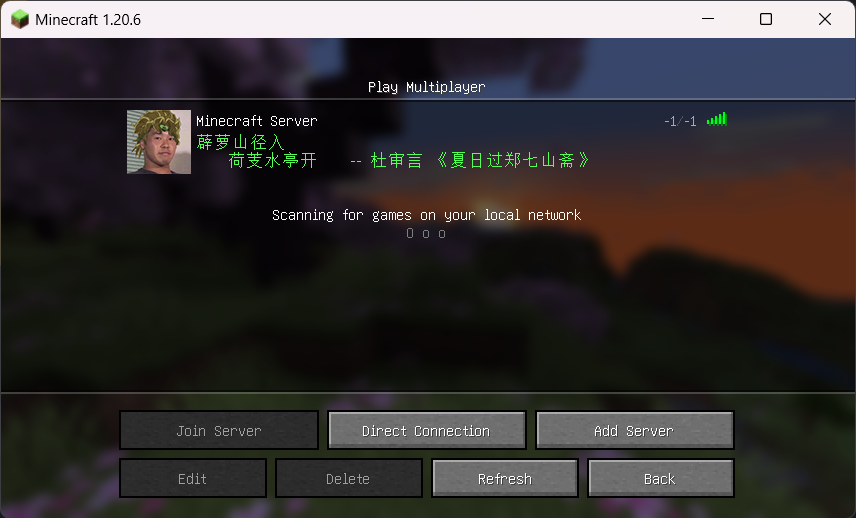
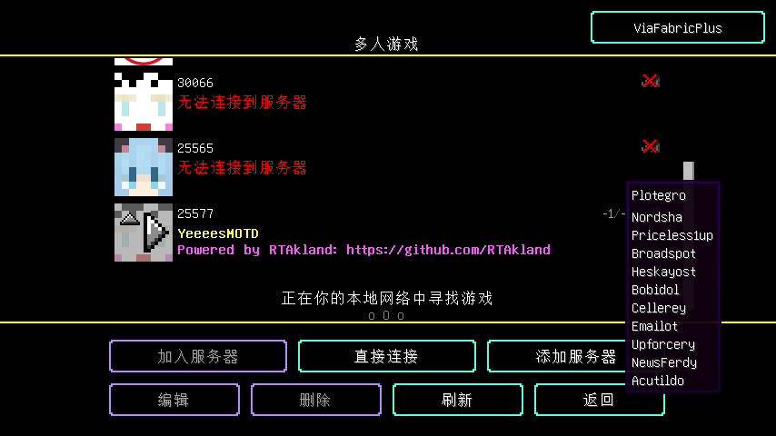

<div align="center">


<h3>Made By <a href="https://github.com/RTAkland">RTAkland</a></h3>


<br>


</div>

* English docs [README](./README_en.md)

# 概述

> 此插件可以让你的服务器信息个性化,包括:`ip指纹(将玩家皮肤的头像作为Icon)`、
> `随机MOTD描述信息`、 `虚假的在线玩家数`、`虚假的最大玩家数`、`随机服务器icon`、
> `*防压测*`、`hitokoto一言`、`随机版本协议号和描述`、 `虚假在线玩家列表`

[!IMPORTANT]
除Bungeecord和Velocity只需要java17就能运行其余平台均需要java21才能运行

# 功能完整性

你可以点击下方展开按钮查看每个平台功能适配

<details>
<summary>展开</summary>

|    功能/平台    | Velocity | Paper(Folia Supported) | Spigot & Bukkit | BungeeCord |
|:-----------:|:--------:|:----------------------:|:---------------:|:----------:|
|    ip指纹     |    ✅     |           ✅            |        ✅        |     ✅      |
|   虚假最大玩家数   |    ✅     |           ✅            |        ✅        |     ✅      |
|   虚假在线玩家数   |    ✅     |           ❌            |        ❌        |     ✅      |
|  随机MOTD信息   |    ✅     |           ✅            |        ✅        |     ✅      |
|   随机ICON    |    ✅     |           ✅            |        ✅        |     ✅      |
|     防压测     |    ✅     |           ✅            |        ✅        |     ✅      |
| hitokoto一言  |    ✅     |           ✅            |        ✅        |     ✅      |
| 虚假协议版本和版本描述 |    ✅     |           ❌            |        ❌        |     ✅      |
|  虚假在线玩家列表   |    ✅     |           ❌            |        ❌        |     ✅      |

</details>

# 使用

在[`Releases`](https://github.com/RTAkland/YeeeesMOTD/releases/)中找到你的服务端对应的文件下载插件,
将插件放入plugins文件夹内即可使用

> YeeeesMOTD现支持`Spigot` `Paper` `Purpur` `Velocity` `Bukkit` `BungeeCord` `Luminol` `Folia` `Leaves`
> 以及各自的衍生服务端, 以上为测试过的服务端

# 配置

## ip指纹

此功能需要服务器`开启正版验证`(`enable online-mode`)并且服务器`有公网IP`(`with public ip`)
ip指纹可以记录玩家登陆游戏的ip在下次玩家使用这个ip ping服务器的时候就会有如下效果(
将玩家皮肤的头作为服务器的icon显示给玩家):



以下是默认的配置文件

```json
  "ipFingerprint": {
"enabled": true
},
```

## 随机服务器icon

这个功能可以实现随机的icon, 可以自定义

随机服务器的icon需要提前准备几张`64x64`像素大小的图片放入服务器`plugins/YeeeesMotd/icons`
文件夹内且图片格式必须为`png`(现在图片的尺寸不必须是64x64了如果不是64x64插件自动将图片缩放成64x64)

> 使用`yeeeesmotd reload`可以热重载服务器随机icon列表

## 随机MOTD信息

这个功能是修改随机的MOTD描述信息,可以自定义, 需要实现如下效果:


你需要打开`config.json`, 找到`descriptions`根下， 你可以看到以下内容，可以修改对应行的内容
其中`line1`表示第一行, `line2`表示第二行, 语法支持[MiniMessage](https://github.com/KyoriPowered/adventure)
以下为默认的配置

```json
 "descriptions": [
{
"line1": "<yellow><bold>YeeeesMOTD",
"line2": "<light_purple><bold>Powered by RTAkland: https://github.com/RTAkland"
},
{
"line1": "<#00ff00><bold>DangoTown 团子小镇 生电服务器欢迎你",
"line2": "<yellow><bold>https://dgtmc.top"
},
{
"line1": "<#00FFFF><bold>团子小镇是一个历史悠久的服务器",
"line2": "<#00FFFF><bold>服务器于2016年开服至今"
}
]
```

## 玩家在线数和最大玩家数

这个功能可以设置虚假的在线玩家数和最大玩家数
**注意: 此功能在`Bukkit & Paper & Spigot服务端无法使用**

默认配置如下:

```json
"maximumPlayer": -1,
"onlinePlayer": -1,
"clearSamplePlayer": true
```

`maximumPlayer`表示最大玩家数默认为`-1`,
`onlinePlayer`表示在线玩家数默认为`-1`,
`clearSamplePlayer`表示是否清除在线玩家列表, 没有清除的效果图见[虚假在线玩家列表](#虚假在线玩家列表)
默认为开启

**注意: 这个功能只是将虚假的数据发送给玩家客户端实际上服务器的最大玩家数并不会受影响, 如果你要更改服务器的最大玩家数你需要更改服务端的配置文件
**

## 虚假在线玩家列表

这个功能可以生成一些随机的玩家的名字显示给客户端，实际上这些玩家并不存在效果如下:



默认的配置如下:

```json
"fakeSamplePlayer": {
"enabled": true,
"fakePlayersCount": 10
},
```

`enabled`表示是否开启默认为关闭
`fakePlayersCount`表示虚假的在线玩家列表, 默认为10,
**该值不要设置超过400过大的话玩家ping服务器会出错, 超过400会被自动设置为10**

如果你将`clearSamplePlayer`设置为`true`那么这个配置将不会生效即使`enabled`改为`true`

>
如果你想将自己的名字添加进这个随机名字列表你可以点击[这里](https://github.com/RTAkland/Static/edit/main/static/username.txt)
> fork仓库并修改然后提交Pull Request, 在我审核后即可将你的名字加入这个列表  
> 你也可以点击[这里](https://static.rtast.cn/static/username.txt)来查看已有玩家列表

## 防压测

此功能可以(大概)防止恶意压测服务器， 所以玩家进服务器之前需要ping一次服务器,
如果ping服务器的事件和进入服务器的过长，则需要重新ping一次服务器,
以下为配置文件

```json
{
  "pingPass": {
    "enabled": false,
    "pingFirstText": "Please ping the server first! / 请先在服务器列表Ping一次服务器",
    "pingAgainText": "Please ping the server again! / 请重新Ping一次服务器",
    "interval": 120
  }
  // ...
}
```

其中`enabled`表示是否开启防压测，默认为关闭`false`.  
`pingFirstText`表示玩家没有先ping服务器就进入服务器，将玩家断开连接的时候提示的信息.  
`rePingText`表示玩家ping服务器的时间和进入服务器的时间间隔过长的提示信息.  
`interval`表示ping服务器和进入服务器的最大间隔时间单位为 `秒`

## Hitokoto一言

此功能可以随机一言里的句子当作服务器描述信息, 你可以修改一言出现的`概率`(`Probability`)(范围0 ~ 100)
可以设置一言句子的`种类`(`Type`) 和 `字体颜色`(`Font color`), 下面是详细的配置文件:

```json
  // ...
"hitokoto": {
"enabled": false,
"color": "#00E5EE",
"type": "a",
"probability": 30
}
// ...
```

在上面的json文本中`hitokoto`根下的`enabled`表示是否开启此功能,默认关闭.  
`color` 表示字体的颜色可以用RGB 16进制表示 ***请务必带上前面的 `#`***  
`probability`表示一言当作MOTD概率默认为30%， 范围0 ~ 100 如果不在这个闭区间内则概率为0,
当然如果你的概率设置成100的话那么最终显示出的概率也只有`50%`, 因为`ip指纹`(`ip fingering`)占用了剩余的`50%`
概率的计算方式见 [概率计算](#概率计算)   
`type` 表示一言的种类可选的种类具体见下表: 当然你也可以使用`all`来指定所有的类别
<details>
<summary>展开</summary>

| 参数 |      说明      |
|:--:|:------------:|
| a  |      动画      |
| b  |      漫画      |
| c  |      游戏      |
| d  |      文学      |
| e  |      原创      |
| f  |     来自网络     |
| g  |      其他      |
| h  |      影视      |
| i  |      诗词      |
| j  |     网易云      |
| k  |      哲学      |
| l  |     抖机灵      |
| 其他 | 作为 `动画`(a)处理 |

</details>

## 虚假版本协议以及协议描述

这个功能可以让你的服务器返回给玩家配置文件内的随即版本号(Protocol Number)以及随即版本描述(Protocol Name)  
版本号就是游戏数据包版本号, 你可以在[这里](https://wiki.vg/Protocol_version_numbers)找到每个版本对应的版本号,
版本描述就是`1.20.4`这是版本描述, 版本号是`765`,765是1.20.4的版本号  
***注意***: 当然这个功能仅仅是返回了虚假的版本信息并不会真正的影响到游玩, 下方是效果图:


其中`shit bro`可以更改成你想要的文字,
如果服务器返回的版本号和客户端的版本号不一致则最右方服务器状态信息就会显示一个❌  
下方是这个功能的配置文件片段:

```json
"fakeProtocol": {
"enabled": false,
"protocolNumberPool": [],
"protocolNamePool": [],
"alwaysInvalidProtocolNumber": false
},

```

`enabled`表示是否开启默认为关闭,
`protocolNumberPool`表示版本号列表,可以填写整形数组例如`[1,2,3,4,5]`请务必使用半角逗号(英文逗号),  
`protocolNamePool` 表示版本描述列表,可以填写字符串数组例如`["Shit bro", "Test"]`请使用半角引号(英文引号),   
当然在这里你也可以使用MiniMessage的语法来进行自定义字体颜色样式, 但是只能使用单个标签不能使用成对的标签例如你可以使用`<green>` 
不能使用`<green>s</green>`你可以参考这个例子进行修改`<green>测试 <yellow><bold>[<onlinePlayer>/<maxPlayer>]`  
`alwaysInvalidProtocolNumber`表示是否总是无效的版本号, 如果设置为`true`则`protocolNumberPool`内的设置不会生效
这会让服务器总是返回版本号为`-1`

### MiniMessage

这里展示了一些MiniMessage格式的用法

```json
[
  {
    // 这里表示黄色和加粗
    "line1": "<yellow><bold>YeeeesMOTD",
    "line2": "<light_purple>test"
  },
  {
    "line1": "<#00ff00><italic>DangoTown 团子小镇 生电服务器欢迎你",
    // 你也可以直接使用RGB16进制表示方法来表示颜色
    "line2": "<yellow><bold>https://dgtmc.top"
  }
]
```

> 更多MiniMessage的用法请前往[MiniMessage Docs](https://docs.advntr.dev/minimessage/format.html#standard-tags)

***注意*** :在`Spigot`平台你不能使用成对的颜色标签来表示颜色例如下方示例

```json
  {
  // 不能这样使用
  "line1": "<yellow>YeeeesMOTD</yellow>",
  // 你应该使用单个标签
  "line2": "<light_purple>test<green>test2"
}
```

# 注意事项

* ip指纹仅能在开启了正版验证的服务器使用,离线服务器因玩家UUID计算方式和正版有区别所以无法使用
* ip指纹仅在有公网IP的服务器生效, 如果使用的是FRP端口映射技术则无法使用

# 开发

建议使用[Intellij IDEA](https://www.jetbrains.com/idea/)进行开发, 本项目百分之百使用[Kotlin](https://kotl.in)  
如果你正在学习Kotlin, 那么本项目可能是你的选择, 项目代码简单易阅读

* 1.Clone仓库

```shell
$ git clone https://github.com/RTAkland/YeeeesMOTD.git
```

* 2.等待IDEA索引完成
* 3.阅读源代码并遵循Apache-2.0协议进行开发和开源

# 开源

- 本项目以[Apache-2.0](./LICENSE)许可开源, 即:
    - 你可以直接使用该项目提供的功能, 无需任何授权
    - 你可以在**注明来源版权信息**的情况下对源代码进行任意分发和修改以及衍生

[](https://app.fossa.com/projects/git%2Bgithub.com%2FRTAkland%2FYeeeesMOTD?ref=badge_large)

# 鸣谢

<div>


<a href="https://www.jetbrains.com/opensource/"><code>JetBrains Open Source</code></a> 提供的强大IDE支持

</div>
